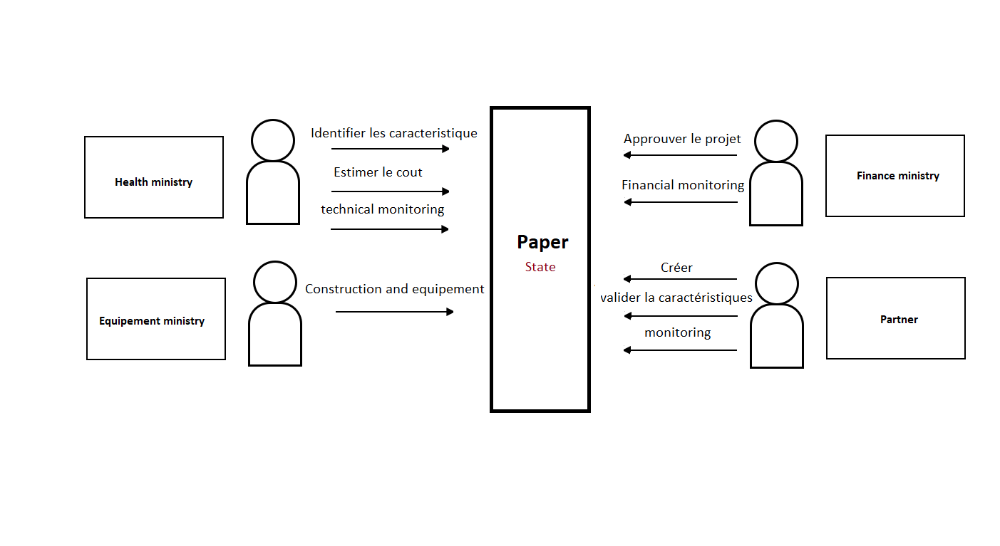

[![Contributors][contributors-shield]][contributors-url]
[![Forks][forks-shield]][forks-url]
[![Stargazers][stars-shield]][stars-url]
[![Issues][issues-shield]][issues-url]
[![MIT License][license-shield]][license-url]

# intra-ministerial blockchain (hyperledger fabric 2)

## architecture




## to run the network
```sh
./startFabric.sh
```


[contributors-shield]: https://img.shields.io/github/contributors/IMagwaI/Hyperledger-Fabric-Health--Network.svg?style=for-the-badge
[contributors-url]: https://github.com/IMagwaI/Hyperledger-Fabric-Health--Network/graphs/contributors
[forks-shield]: https://img.shields.io/github/forks/IMagwaI/Hyperledger-Fabric-Health--Network.svg?style=for-the-badge
[forks-url]: https://github.com/IMagwaI/Hyperledger-Fabric-Health--Network/network/members
[stars-shield]: https://img.shields.io/github/stars/IMagwaI/Hyperledger-Fabric-Health--Network.svg?style=for-the-badge
[stars-url]: https://github.com/IMagwaI/Hyperledger-Fabric-Health--Network/stargazers
[issues-shield]: https://img.shields.io/github/issues/IMagwaI/Hyperledger-Fabric-Health--Network.svg?style=for-the-badge
[issues-url]: https://github.com/IMagwaI/Hyperledger-Fabric-Health--Network/issues
[license-shield]: https://img.shields.io/github/license/IMagwaI/Hyperledger-Fabric-Health--Network.svg?style=for-the-badge
[license-url]: https://github.com/othneildrew/Best-README-Template/blob/master/LICENSE.txt

